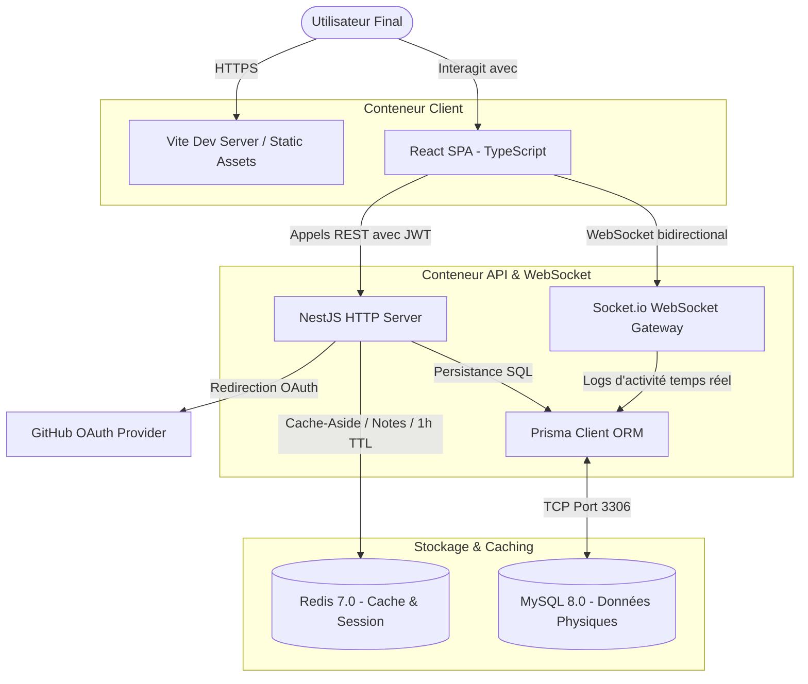

# ⚡ Planner Pro — Spécifications d'Ingénierie de Production & Guide du Monorepo

[](#)
[](#)
[](#)
[](#)
[](#)
[](#)
[](#)

> [!IMPORTANT]
> **Planner Pro** est une application fullstack monorepo de gestion du temps, des tâches (Kanban), du time-blocking (calendrier) et de prise de notes intelligentes. Ce document regroupe les spécifications issues des rôles d'**Architecte Logiciel Senior**, de **UX/UI Designer**, de **DevOps & DevSecOps Engineer**, ainsi que de **Product Owner / Scrum Master**.

---

## 🏗️ 1. Architecture Logicielle & Design Technique (Senior Architect Perspective)

### Modélisation C4 Container Diagram
Le système est modélisé selon l'architecture C4 Niveau 2 (Container Diagram) pour structurer clairement les interactions entre conteneurs de services.



### Analyse des Compromis Techniques (Trade-off Analysis)

| Technologie | Solution Adoptée | Compromis Accepté | Rationale d'Architecture |
| :--- | :--- | :--- | :--- |
| **Backend Framework** | **NestJS** vs Express natif | Courbe d'apprentissage plus élevée | Typage strict par défaut, injection de dépendances robuste facilitant la testabilité et la modularité. |
| **ORM** | **Prisma** vs TypeORM / SQL brut | Moins performant pour l'écriture de requêtes de masse | Productivité accrue des développeurs, auto-génération de types TS à la volée, et outil de migration (`prisma migrate`) déterministe. |
| **Mise en cache** | **Redis** (Cache-Aside) | Problématique de cohérence éventuelle | Diminution drastique de la charge de lecture sur MySQL pour les notes fréquemment mises à jour (Invalidation immédiate sur chaque écriture/sauvegarde). |
| **Base de données** | **MySQL** vs SQLite | Complexité DevOps accrue (Docker/Volume) | SQLite bloque l'écriture concurrente. MySQL 8 permet des écritures/lectures massives et assure une scalabilité horizontale sereine. |

---

### Architecture Decision Records (ADR)

#### ADR-001 : Chiffrement AES-256-GCM des jetons tiers
* **Statut** : Accepté.
* **Contexte** : Les jetons OAuth GitHub des utilisateurs doivent être persistés dans MySQL pour permettre des requêtes futures aux API GitHub (SSO/liaisons de repo). Stocker ces tokens en clair représente un risque critique de sécurité en cas de vol de base de données.
* **Décision** : Implémentation d'une couche d'encapsulation cryptographique symétrique utilisant **AES-256-GCM** (Galois/Counter Mode). Chaque jeton est chiffré à l'aide d'une clé secrète de 32 octets (`ENCRYPTION_KEY`), produisant un vecteur d'initialisation unique (IV) de 12 octets et un tag d'authentification de 16 octets.
* **Conséquences** : Protection robuste contre la falsification de secrets. L'absence de tag ou d'IV conforme invalide immédiatement le jeton lors du déchiffrement. Une clé invalide de 32 octets déclenche un arrêt propre et immédiat du backend au démarrage (Fail-Fast).

#### ADR-002 : Script de Résilience au Boot (wait-for-db)
* **Statut** : Accepté.
* **Contexte** : Dans un environnement multi-conteneurs Docker Compose, le conteneur MySQL démarre plus lentement que le backend NestJS, provoquant des erreurs de connexion fatales lors des migrations Prisma de démarrage.
* **Décision** : Développement d'un script Node léger à la racine du backend (`wait-for-db.js`) qui utilise le module `net` natif pour tester le port TCP `3306` en boucle toutes les 2 secondes. Le backend attend que ce port réponde avant de lancer `prisma db push` et de démarrer le serveur.
* **Conséquences** : Éradication totale des crashs liés à l'initialisation asynchrone des services de données.

### Sécurisation & Robustesse de Production (Audit Technique)

Pour répondre aux exigences d'une mise en production de niveau entreprise, quatre correctifs majeurs ont été implémentés directement dans le backend :

1. **Détection de Cycles de Dépendances (DFS)** :
   - **Problématique** : L'ajout de dépendances de planification (ex. : la tâche A finit pour que la tâche B commence) pouvait mener à des blocages ou des boucles circulaires ($A \rightarrow B \rightarrow A$) qui faisaient planter le rendu de Gantt.
   - **Solution** : Implémentation d'un algorithme de parcours de graphe en profondeur (DFS - Depth-First Search) récursif dans [projects.service.ts](file:///home/gaetan/Documents/GitHub/planner-pro/backend/src/projects/projects.service.ts). Si un cycle est détecté, l'API rejette l'opération avec une erreur `400 BadRequestException`.

2. **Contrôle d'Accès Basé sur les Rôles de Workspace (RBAC)** :
   - **Problématique** : N'importe quel membre d'un workspace pouvait modifier les jalons, les livrables, valider des livraisons ou assigner des ressources.
   - **Solution** : Ajout d'une méthode de validation `assertWorkspaceRole` dans le service des projets. Les modifications administratives sensibles lèvent désormais une exception `403 ForbiddenException` si l'utilisateur n'a pas un rôle d'administration (`OWNER` ou `ADMIN`) au sein du workspace.

3. **Optimisation du Calendrier (Filtrage Temporel)** :
   - **Problématique** : Le chargement de tous les blocs de temps historiques (`Timeblocks`) dégradait les performances sur le long terme.
   - **Solution** : Ajout de filtres temporels optionnels `start` et `end` sur l'API `GET /projects/timeblocks/all` pour ne charger que les blocs pertinents de la journée ou de la semaine visible sur l'interface.

4. **Parser de Notes Immunisé** :
   - **Problématique** : Les tâches rédigées à titre d'exemples dans les blocs de code Markdown (triple backticks ` ``` `) dans les notes étaient lues à tort par le parser, créant des faux positifs en base de données.
   - **Solution** : Ajout d'un drapeau d'état dans [notes.service.ts](file:///home/gaetan/Documents/GitHub/planner-pro/backend/src/notes/notes.service.ts) qui force le parseur à ignorer toutes les lignes de texte situées entre des délimiteurs de blocs de code.

---

## 🎨 2. Design System & Ergonomie UX (UX/UI Designer Perspective)

### Design Tokens (Variables CSS)
Notre design s'inscrit dans un style **Glassmorphism Premium** intégrant une hiérarchie visuelle sombre et contrastée.

```css
:root {
  /* Palette Chromatique */
  --bg-main: #0a0a0f;              /* Noir profond pour minimiser la fatigue visuelle */
  --glass-bg: rgba(18, 18, 26, 0.6); /* Transparence pour l'effet de verre dépoli */
  --glass-border: rgba(255, 255, 255, 0.08); /* Bordure subtile brillante */
  --primary: hsl(250, 85%, 65%);   /* Violet électrique pour l'action principale */
  --secondary: hsl(190, 90%, 50%); /* Turquoise réactif pour les micro-interactions */
  --text-primary: #f8fafc;
  --text-secondary: #94a3b8;
  
  /* Flou d'Arrière-Plan (Glassmorphism) */
  --backdrop-blur: blur(16px) saturate(180%);

  /* Systèmes d'Espacement & Angles */
  --radius-lg: 16px;
  --radius-md: 10px;
  --transition-smooth: all 0.3s cubic-bezier(0.25, 0.8, 0.25, 1);
}
```

### Directives d'Accessibilité (a11y) & Lois UX
1. **Loi de Hick (Surcharges cognitives évitées)** : Le tableau de bord n'affiche que les composants pertinents (Kanban global, calendrier quotidien, note active). L'utilisateur peut passer d'un module à l'autre sans changer de contexte mental.
2. **WCAG 2.1 AA Compliance** :
   - **Ratio de Contraste** : Le texte clair (`--text-primary`) sur fond sombre (`--bg-main` ou `--glass-bg`) garantit un ratio supérieur à 4.5:1.
   - **Cibles Tactiles** : Les boutons d'action et les éléments déplaçables du Kanban respectent une zone cible minimale de `44px x 44px`.
   - **Éléments interactifs** : Ajout systématique d'états de focus (`:focus-visible`) très nets en turquoise électrique (`--secondary`) pour la navigation au clavier.

---

## 🐳 3. Stratégie de Conteneurisation & DevOps (DevOps Perspective)

### Analyse du Dockerfile du Backend (`/backend/Dockerfile`)
L'image de conteneur du backend intègre des mécanismes avancés pour supporter à la fois la compilation de production et le re-linking dynamique en environnement de développement local :

```dockerfile
FROM node:18-alpine

# Installer les dépendances système pour Prisma (openssl et libc6-compat pour Alpine)
RUN apk add --no-cache openssl libc6-compat

# Installer pnpm globalement
RUN npm install -g pnpm@9.15.4

# Créer le répertoire de travail et lui attribuer les droits node
RUN mkdir -p /home/node/app && chown -R node:node /home/node/app
WORKDIR /home/node/app
USER node

# Copier les fichiers de configuration du monorepo pnpm à la racine
COPY --chown=node:node package.json pnpm-lock.yaml pnpm-workspace.yaml ./
COPY --chown=node:node backend/package.json ./backend/
COPY --chown=node:node frontend/package.json ./frontend/

# Installer les dépendances du monorepo filtrées pour le backend
RUN --mount=type=cache,id=pnpm,target=/home/node/.local/share/pnpm/store/v3 pnpm install --filter backend... --no-frozen-lockfile --prod=false

# Copier le reste des fichiers du backend
COPY --chown=node:node backend ./backend/
WORKDIR /home/node/app/backend

# Générer le client Prisma et compiler l'application NestJS
RUN pnpm exec prisma generate
RUN pnpm run build

EXPOSE 3001

# Lancer l'attente de MySQL, la regénération/migration puis démarrer l'application
CMD node wait-for-db.js && (pnpm install --filter backend... --no-frozen-lockfile --prod=false --config.confirmModulesPurge=false || true) && pnpm exec prisma generate && pnpm exec prisma migrate deploy && node dist/main
```

### Rationale DevOps & Résilience au démarrage :
- **Sécurisation par défaut (Principle of Least Privilege)** : L'image s'exécute sous l'utilisateur natif `node` et non `root` pour éviter toute élévation de privilèges.
- **Résilience du volume de développement (Modules Purge)** : Lors du montage du volume local `./backend:/home/node/app/backend` pour le développement en direct, les packages installés dans le conteneur peuvent entrer en conflit avec ceux de l'hôte. 
  - **Solution** : Le script d'entrée réinstalle et relie dynamiquement les modules (`pnpm install`).
  - **Bypass interactif** : L'option `--config.confirmModulesPurge=false` a été introduite pour désactiver l'invite interactive de confirmation de pnpm en environnement non-interactif, évitant ainsi le blocage et les crashs au boot du conteneur.
- **Synchronisation automatique** : Au démarrage, le conteneur attend la base de données, applique automatiquement les migrations Prisma en attente, génère le client local et lance le serveur.

---

## 📊 4. Gestion de Produit Agile (Product Owner / Scrum Master)

### Roadmap & Périmètre Produit (Priorisation MoSCoW)

* **MUST HAVE** (Livré & Sécurisé) :
  * Gestion de projet avec colonnes Kanban dynamiques.
  * Prise de notes intelligente avec auto-parsing de tâches markdown.
  * Authentification unique SSO GitHub + Sécurisation des sessions par JWT.
  * Suivi du temps en temps réel synchronisé par sockets.
* **SHOULD HAVE** (Prochaines itérations prévues) :
  * Mode hors-ligne avec synchronisation automatique lors de la reconnexion (Service Workers).
  * Rappels de tâches par notification Web Push pour le calendrier.
* **COULD HAVE** (Fonctionnalités avancées bonus) :
  * Analyse sémantique des notes par IA (NLP) pour regrouper automatiquement les idées connexes.
  * Exportation des rapports de temps sous formats CSV et PDF pour la facturation client.

### Normes de Qualité d'Équipe (DoR & DoD)

#### Definition of Ready (DoR) - Pour qu'une tâche soit lancée :
- [ ] La spécification fonctionnelle ou la *User Story* comprend le contexte utilisateur.
- [ ] Les critères d'acceptation sont rédigés et univoques.
- [ ] Les dépendances techniques (ex: structures de base de données) sont prêtes ou mockées.

#### Definition of Done (DoD) - Pour qu'une tâche soit validée :
- [x] Le code est compilé sans avertissements (TypeScript & Linters OK).
- [x] Le schéma Prisma est migré et les tests d'intégration de base de données sont au vert.
- [x] Les flux de chiffrement (tokens) et de routage (JWT) ont été validés par test.
- [x] La documentation a été mise à jour (Fichiers API, README ou ADR si impact architectural).
- [x] Les critères d'accessibilité (contraste, raccourcis claviers) sont respectés.

---

## 🧪 5. Validation par ligne de commande (CLI Integration Tests)

L'application intègre des scripts de validation de bout en bout en ligne de commande pour s'assurer du bon fonctionnement des APIs et de l'alignement des fonctionnalités avec le frontend.

### A. Test de création de projet de base
Pour valider l'authentification mockée, la création de projet, de jalons et de livrables associés :
```bash
BACKEND_URL=http://localhost:3009 node backend/test_cli_project.js
```

### B. Test des fonctionnalités avancées (Calendrier, Planification, Notes & Équipes)
Pour valider l'extraction de tâches depuis les notes Markdown, le time-blocking, la planification de dépendances Gantt, et la synchronisation double-sens des cases à cocher :
```bash
BACKEND_URL=http://localhost:3009 node backend/test_cli_features.js
```

### C. Test de robustesse (Détection de cycles & RBAC)
Pour valider la détection de dépendances cycliques (DFS), le contrôle d'accès RBAC (rejet des actions d'écriture pour les rôles `MEMBER`/`VIEWER` avec erreur 403), le filtrage du calendrier et l'exclusion des blocs de code Markdown :
```bash
BACKEND_URL=http://localhost:3009 node backend/test_cli_improvements.js
```

---

## 🚀 6. Procédure de Boot et d'Exploitation

### 📋 Prérequis Locaux
- **Docker Engine** >= 20.10.x et **Docker Compose** >= 2.x
- Ou **NodeJS** (v18.x) et **pnpm** (v9.x) pour le développement hôte.

### 🔌 Initialisation de l'Environnement
1. Créez votre fichier d'environnement local :
   ```bash
   cp .env.example .env
   ```
2. Modifiez le `.env` pour y intégrer vos secrets GitHub OAuth (voir [Section GitHub OAuth](#sso-github)).

### 🐳 Démarrage Rapide (Tout-en-un Docker)
```bash
docker-compose up --build
```
Cette commande automatise l'installation, le démarrage de MySQL, l'attente active du serveur de base de données par le backend, la synchronisation du schéma Prisma, et le lancement du serveur React avec Hot-Reload.

### 🏃‍♂️ Démarrage en Mode Développement Local (Hôte)
Si vous développez localement avec un serveur de développement natif pour profiter de performances HMR accrues :

1. Installer l'ensemble du monorepo :
   ```bash
   pnpm install
   ```
2. Assurez-vous que vos instances MySQL et Redis locales sont actives, puis poussez le schéma de base de données :
   ```bash
   pnpm --filter backend exec prisma db push
   ```
3. Lancer les deux instances en mode Watch/Dev :
   ```bash
   pnpm dev
   ```

---

## 🔗 <a id="sso-github"></a>6. Configuration Spécifique du Single Sign-On (SSO) GitHub

Afin de pouvoir connecter des utilisateurs avec leur compte GitHub, configurez les variables d'environnement OAuth :

1. Créez une application sur [GitHub Developer Settings](https://github.com/settings/developers).
2. Configurez les adresses suivantes :
   * **Homepage URL** : `http://localhost:3000`
   * **Authorization callback URL** : `http://localhost:3001/auth/github/callback`
3. Générez et renseignez le `CLIENT_ID` et `CLIENT_SECRET` dans votre fichier `.env` ou directement au niveau des variables d'environnement de votre conteneur Backend dans `docker-compose.yml`.
