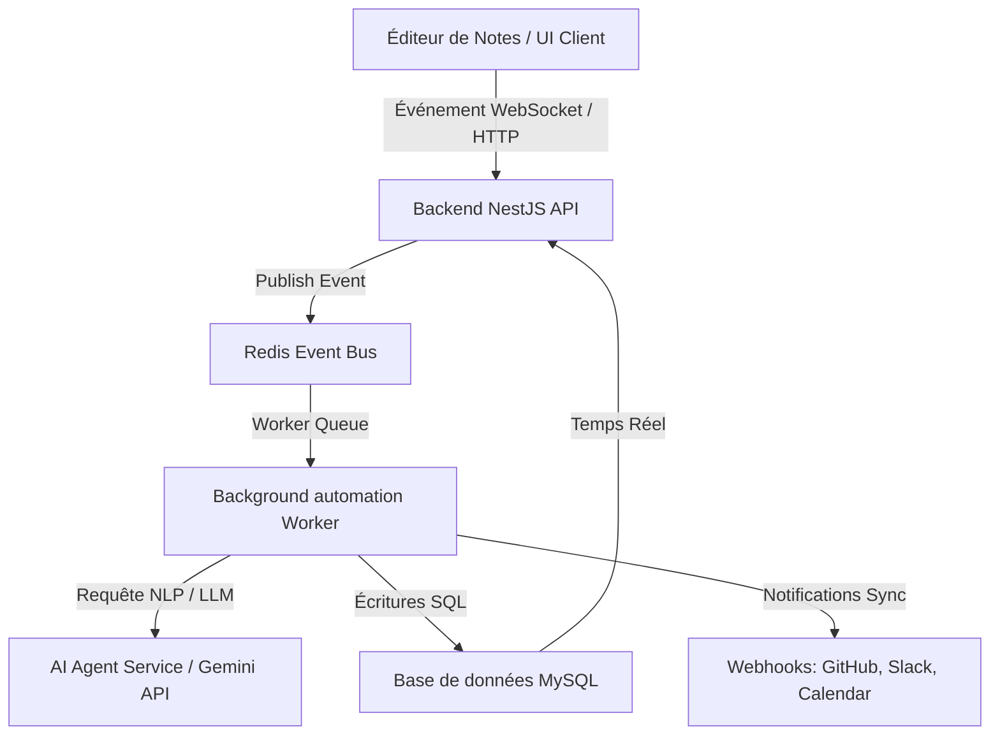

# Rapport d'Architecture Logicielle : Automatisation, Intelligence & Suivi d'Évolution Premium dans Planner Pro

Ce rapport présente une vision d'architecture technique et de design system permettant de transformer **Planner Pro** en une plateforme de gestion de projet hautement automatisée et intelligente. L'objectif est de réduire la charge mentale des développeurs et des chefs de projet en automatisant les flux répétitifs et en connectant de manière fluide les notes, le calendrier, les tâches, les équipes et le suivi d'avancement.

---

## 🗺️ Vision Globale de l'Architecture

Pour supporter ces automatisations sans dégrader les performances, nous proposons une architecture **Event-Driven (pilotée par les événements)** et un service d'**arrière-plan asynchrone** (Background Worker) couplé à une passerelle d'**Intelligence Artificielle (LLM + NLP Service)**.

---

## 💡 Suggestions d'Automatisations Intelligentes

### 1. Prise de Notes Connectée & Extraction NLP Asynchrone

Actuellement, le parseur de notes extrait les tâches simples. Nous pouvons l'élever au niveau supérieur :

- **Auto-Extraction Enrichie** : Le parser analyse le texte libre de la note et identifie automatiquement :
  - **Les dates limites** : _"La maquette doit être validée d'ici mardi prochain à 14h"_ $\rightarrow$ Génère automatiquement une date de fin sur la tâche.
  - **Les assignations** : _"@Gaetan va s'occuper de tester l'API"_ $\rightarrow$ Assigne automatiquement le membre.
  - **Les dépendances** : _"La phase de test dépend du déploiement de la BDD"_ $\rightarrow$ Crée automatiquement le lien Gantt (Finish-to-Start).
- **Command Palette Intégrée (UX)** : Un éditeur de type Notion avec un menu `/` permettant d'insérer rapidement des jetons dynamiques : `/tache`, `/jalon`, `/ressource`.

> [!TIP]
> **Implémentation Technique** : Utilisation d'un modèle LLM léger (ex: Gemini Flash en mode Structured Output JSON) déclenché en tâche de fond sur l'événement `NoteUpdatedEvent`. Le traitement asynchrone évite de bloquer l'interface d'édition de l'utilisateur.

---

### 2. Planification & Calendrier Intelligent (Smart Scheduling)

- **Auto-Scheduling & Résolution de Contraintes** :
  Si une tâche prend du retard (détecté via le time tracking ou un retard de commit/PR), le système recalcule automatiquement le chemin critique (méthode CPM - Critical Path Method) et propose au chef de projet une réorganisation optimisée du planning en un clic, en tenant compte des dépendances et de la charge des développeurs.
- **Smart Time-blocking** :
  Le calendrier analyse les tâches hautement prioritaires affectées à un développeur pour la semaine et réserve automatiquement des blocs de "Focus Time" de 2 heures d'affilée dans son agenda (synchronisé Google Calendar/Outlook) durant ses heures d'efficacité maximale présumées.
- **Clôture de tâche par fusions de code (GitOps)** :
  Liaison automatique des Pull Requests GitHub aux tâches. Lorsqu'une PR contenant `Fixes #taskID` est fusionnée :
  - La tâche passe à `DONE`.
  - Le bloc de temps prévu dans le calendrier est validé dans les feuilles de temps réelles.
  - Le reste du temps planifié inutile est libéré dans l'agenda.

---

### 3. Suivi d'Évolution de Projet Premium (Smart Progress Tracking)

Pour donner de la visibilité en temps réel aux chefs de projet sans effort de reporting pour les développeurs, le système doit modéliser l'avancement avec précision et esthétique :

- **Progression Pondérée et EVM (Earned Value Management)** :
  - Au lieu d'un calcul de pourcentage basé uniquement sur le nombre de tâches accomplies, la progression globale intègre la complexité relative (Story Points ou heures budgétisées) et la validation des livrables techniques.
  - Calcul de la variance de planification pour détecter si le projet dévie de sa trajectoire d'origine.
- **Sparklines de Tendance de Progression** :
  - Intégration de micro-graphiques linéaires ultra-minimalistes (Burnup/Burndown) directement sur les cartes de projets. Ces graphiques néon (bleus ou verts) montrent la pente d'avancement sur les 7 derniers jours par rapport à la courbe cible.

---

### 4. Gestion d'Équipe et Capacité Prédictive (Smart Team Management)

- **Détecteur de Surcharge et Prévention du Burnout** :
  Le backend génère des alertes proactives avec des **propositions de réallocation** :
  - _"Le développeur X est à 130% de charge cette semaine. Recommander de réassigner la tâche Y (estimée à 8h) au développeur Z qui a 40% de disponibilité."_
- **Skill-based Matchmaking (Assignation Intelligente)** :
  Le système analyse la description des tâches pour recommander les développeurs les plus compétents en fonction de leur historique de succès sur des technos similaires.

---

### 5. Automatisation de Gouvernance (Le "CI/CD du Product Manager")

- **Génération Automatique de Rapports de Clôture** :
  Dès que toutes les tâches et livrables d'un projet sont marqués comme "Acceptés" (ce qui déclenche notre écran de clôture dans le frontend), le système génère un rapport PDF/Markdown de performance (KPIs) et notifie l'équipe sur Slack/Discord.
- **Checklists de Livraison Autonomes** :
  Les fusions et tests CI réussis valident automatiquement les critères techniques de la checklist sans intervention humaine.

---

## 🎨 Design System & Intégration Visuelle (UX/UI Premium)

Pour rendre ces fonctionnalités intuitives, le Design System doit intégrer des composants de contrôle d'IA et d'automatisation fluides :

### 1. Visualisation de Progression & Pourcentages Modernes

- **Radial Progress Ring Glowing** :
  Un composant SVG circulaire dynamique avec un effet de lueur (glow) et un dégradé de couleur harmonieux représentant la progression globale du projet.
  - En cours : Dégradé du Bleu Électrique au Violet Aqua.
  - Terminé et validé : Vert Émeraude brillant.
  - Retard ou dérive de planning : Orange/Rouge volcanique pulsant.
- **Fluid Morphing Progress Bars** :
  Des barres de progression horizontales qui s'étendent de manière fluide via des animations basées sur des courbes de Bézier complexes (`cubic-bezier(0.4, 0, 0.2, 1)`) lors des mises à jour en arrière-plan.
- **Number Ticker (Compteurs Animés)** :
  Les pourcentages ne s'affichent pas de façon statique : ils s'animent via un compteur à défilement rapide de `0%` à `X%` à chaque chargement de page ou modification de statut de tâche, renforçant l'impression d'une application vivante et réactive.

### 2. La Command Bar Centrale (⌘+K ou Ctrl+K)

Un composant d'interface global utilisant une esthétique de type "Glassmorphic Dialog" qui permet aux utilisateurs de piloter l'application en langage naturel (ex : _"Assigne Gaetan sur la tâche sécurité et bloque 2 heures demain matin dans son calendrier"_).

### 3. Retours Visuels Prédictifs (Drag-and-Drop Gantt/Kanban)

- Lors du glissement d'une tâche sur le diagramme de Gantt, le Design System met en surbrillance de manière subtile (avec un effet de pulsation néon ambre/rouge) toutes les tâches en aval qui seront décalées par cette modification de planning, ainsi que la jauge de capacité du développeur assigné.

---

## 🚀 Plan d'Implémentation Technique Rapide (Quick Wins)

Pour démarrer rapidement, voici les étapes techniques recommandées :

| Phase       | Objectif                                  | Outils & Backing                                                                                                                                                | Temps Estimé |
| :---------- | :---------------------------------------- | :-------------------------------------------------------------------------------------------------------------------------------------------------------------- | :----------- |
| **Phase 1** | **Bypass de saisie de tâche / NLP**       | Intégrer l'API Gemini Flash dans le service de Note pour extraire en JSON les tâches, dates limites et assignations implicites.                                 | 3 jours      |
| **Phase 2** | **Progress Rings & Tickers Animés**       | Implémenter les composants SVG circulaires avec animations CSS de défilement des pourcentages et transitions cubic-bezier.                                      | 2 jours      |
| **Phase 3** | **Intégration Webhooks GitHub/GitLab**    | Configurer des webhooks pour écouter les fusions de PR et fermer automatiquement les tâches de Planner Pro.                                                     | 2 jours      |
| **Phase 4** | **Assistant de Réallocation (Dashboard)** | Ajouter un bouton "Optimiser le planning" sur l'écran Ressources utilisant un algorithme glouton simple de distribution des tâches sur les profils disponibles. | 4 jours      |
