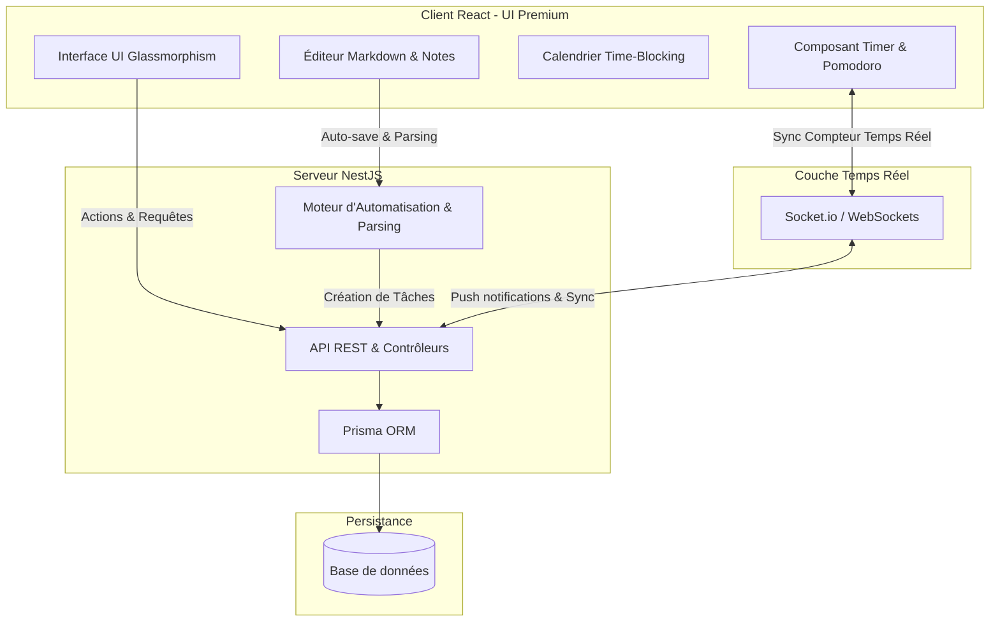

# Vision Produit & Spécifications Fonctionnelles - Planner-Pro

Ce document formalise la vision stratégique, ergonomique et technique de **Planner-Pro**, afin de servir de boussole avant le lancement du développement.

---

## 🎯 Philosophie du Produit : "Focus & Flow"
L'objectif de **Planner-Pro** n'est pas d'être une énième liste de tâches passive, mais un **hub de productivité actif et immersif**. L'application aide l'utilisateur à entrer dans un état de "Flow" (concentration profonde) en éliminant les frictions de saisie et en liant dynamiquement la réflexion (les notes), l'organisation (les projets) et l'action (le temps réel).

---

## 🏛️ Les 4 Piliers de l'Expérience Utilisateur

### 1. La Planification Adaptative (Petits, Moyens et Grands Projets)
* **Vision** : L'outil doit être aussi simple à utiliser pour planifier l'achat d'un livre (petit projet) que pour structurer le lancement d'une startup (grand projet).
* **Fonctionnalités** :
  - **Hiérarchie à Niveaux** : `Espaces de travail ➔ Projets ➔ Tâches ➔ Sous-tâches`.
  - **Vues Multiples** :
    - Vue *Tableau Kanban* (pour le suivi visuel).
    - Vue *Liste hiérarchique* (pour l'organisation rapide).
    - Indicateurs visuels de progression globale (pourcentage de complétion).

### 2. Le Time Tracking Actif & Temps Réel
* **Vision** : Lier intimement le temps planifié au temps réellement passé, de manière dynamique et sans effort.
* **Fonctionnalités** :
  - **Chronomètre Flottant** : Lancement d'un timer en un clic sur n'importe quelle tâche active.
  - **Mode Pomodoro Immersif** : Un mode plein écran optionnel ou avec assombrissement de l'interface pour forcer la concentration (sessions de 25 min de focus / 5 min de pause).
  - **Historique et Analytics** : Rapports graphiques élégants sur la répartition du temps passé par projet.

### 3. Le Calendrier Immersif (Time-Blocking)
* **Vision** : Permettre à l'utilisateur de s'approprier son temps en planifiant ses journées visuellement.
* **Fonctionnalités** :
  - **Time-Blocking Interactif** : Glisser-déposer une tâche de la Todo-list directement sur le calendrier pour lui allouer un créneau horaire.
  - **Synchronisation Bidirectionnelle** : Déplacer un bloc horaire dans le calendrier met à jour l'heure de planification de la tâche.
  - **Indicateur de Surcharge** : Alerte visuelle (jauge de couleur) si le temps bloqué dépasse le temps de travail disponible de la journée.

### 4. Le Bloc-notes Intelligent & Automatisations
* **Vision** : Capturer les idées à la volée et les transformer en actions sans interrompre le processus de réflexion.
* **Fonctionnalités** :
  - **Éditeur Markdown Épuré** : Prise de notes fluide avec un design minimaliste.
  - **Auto-Parsing (Notes-to-Tasks)** : En écrivant par exemple `- [ ] Relancer le client à 14h #ProjetA`, l'application crée automatiquement la tâche associée au projet avec un rappel.
  - **Notifications Temps Réel** : Alertes push ou notifications internes à l'application pour rappeler les tâches extraites des notes.

---

## 🛠️ Le Modèle Conceptuel (Architecture Globale)

Voici comment les différents modules interagissent pour créer une expérience temps réel sans coupure :

---

## ✨ L'Effet "WOW" : Ergonomie et Micro-interactions

Pour offrir une expérience haut de gamme (18+ ans d'expérience UX/UI) :
- **Glassmorphism & Mode Sombre** : Fond semi-transparent avec floutage d'arrière-plan (`backdrop-filter: blur`), bordures fines lumineuses et contrastes élevés.
- **Micro-animations** : 
  - Effet de pulsation douce sur le bouton du chronomètre actif.
  - Cartes de tâches qui "glissent" avec de l'inertie lors du drag-and-drop.
  - Notifications qui apparaissent avec un effet de fondu et de glissement élégant.
- **Raccourcis Clavier Globaux** : Appuyer sur `Cmd/Ctrl + K` ouvre une barre de commande rapide pour créer une tâche, démarrer un timer ou ouvrir une note, n'importe où dans l'application.
